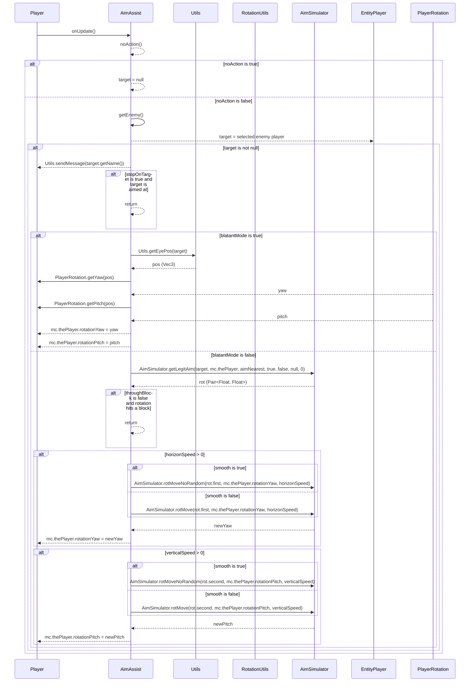

import { Callout, Steps, Cards, Card } from "nextra/components";

## AimAssist Documentation

### Overview
The AimAssist module helps you aim at other players by automatically adjusting your crosshair. It offers various settings to customize its behavior to suit different playstyles and preferences.

### Settings

#### Horizon Speed
- **Description**: Controls the horizontal speed of the aim assist.
- **Range**: 0.0 to 10.0
- **Increment**: 0.05

<Callout type="default" emoji="️👾">
Higher Horizon Speed can help you quickly adjust to moving targets.
</Callout>

#### Vertical Speed
- **Description**: Controls the vertical speed of the aim assist.
- **Range**: 0.0 to 10.0
- **Increment**: 0.05

<Callout type="default" emoji="️👾">
Use Vertical Speed to keep your aim aligned when players jump or fall.
</Callout>

#### FOV
- **Description**: Sets the field of view within which the aim assist will operate.
- **Range**: 15.0 to 360.0
- **Increment**: 1.0

<Callout type="info" emoji="️🚀">
Adjust FOV: Setting a lower FOV can make the aim assist more focused and less noticeable.
</Callout>

#### Distance
- **Description**: Specifies the maximum distance to a target for the aim assist to activate.
- **Range**: 1.0 to 10.0
- **Increment**: 0.5

#### Click Aim
- **Description**: Enables aim assist only when the mouse is clicked.

#### Stop On Target
- **Description**: Stops aim assist once the target is acquired.

#### Break Blocks
- **Description**: Allows the aim assist to **not** operate even when breaking blocks.

#### Single Target
- **Description**: Locks on to a single target without switching to another target.

#### Weapon Only
- **Description**: Activates aim assist only when holding a weapon.

<Callout type="info" emoji="️🚀">
Weapon Only ensures that the aim assist does not interfere when using tools or other non-combat items.
</Callout>

#### Aim Invis
- **Description**: Allows aim assist to target invisible players.

#### Blatant Mode
- **Description**: Aggressive aim assist mode that instantly locks onto targets.

<Callout type="error" emoji="️🚫">
Blatant Mode is very aggressive and can be easily detected. Use it with caution.
</Callout>

#### Ignore Teammates
- **Description**: Excludes teammates from being targeted by the aim assist.

<Callout type="default" emoji="️👾">
Use Ignore Teammates to avoid accidentally targeting your allies during team fights.
</Callout>

#### Aim Nearest
- **Description**: Automatically targets the closest point on a player's hitbox.

#### Through Block
- **Description**: Allows aim assist to target players through blocks.

#### Smooth
- **Description**: Makes the aim assist as smooth as possible.

<Callout type="info" emoji="️🚀">
Smooth Setting: While enabling smooth aiming makes the aim assist **high detectable**, it might reduce the speed and efficiency of targeting.
</Callout>

### Usage
1. **Enable the Module**: Activate the AimAssist module from the mod's interface.
2. **Adjust Settings**: Customize the settings to your preference. For example, increase the Horizon Speed for faster horizontal aiming or enable Click Aim to restrict aim assist to when you click the mouse.
3. **Play**: The aim assist will help you aim at players based on your configured settings.

### Tips
<Callout type="default" emoji="️🚀">
Customize for Situations: Different scenarios (e.g., PvP combat vs. casual play) might benefit from different settings.
</Callout>

### Example Configuration
- **Horizon Speed**: 4.0
- **Vertical Speed**: 2.0
- **FOV**: 90.0
- **Distance**: 5.0
- **Click Aim**: Enabled
- **Stop On Target**: Disabled
- **Break Blocks**: Disabled
- **Single Target**: Enabled
- **Weapon Only**: Enabled
- **Aim Invis**: Disabled
- **Blatant Mode**: Disabled
- **Ignore Teammates**: Enabled
- **Aim Nearest**: Enabled
- **Through Block**: Disabled
- **Smooth**: Enabled

By customizing these settings, you can optimize the AimAssist module to best fit your gameplay style and requirements.
