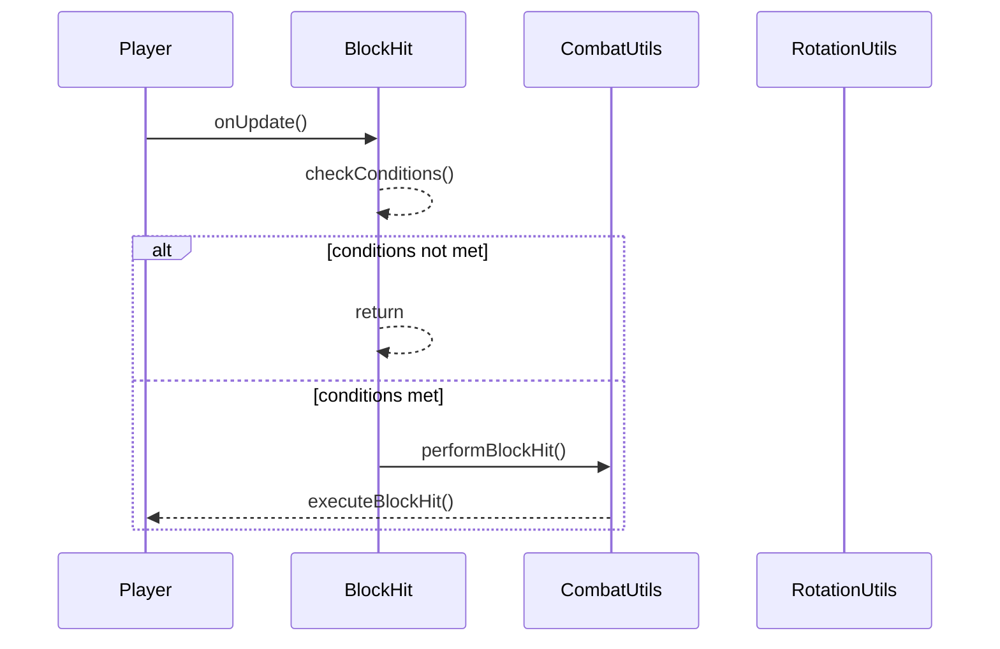

import { Callout, Steps, Cards, Card } from "nextra/components";

## BlockHit Documentation

### Overview
The BlockHit module enhances your combat abilities by automatically blocking and hitting in quick succession. It offers various settings to customize its behavior to suit different playstyles and preferences.

### Settings

#### Block Delay
- **Description**: Controls the delay between blocking and hitting.
- **Range**: 0.0 to 1.0
- **Increment**: 0.05

<Callout type="default" emoji="️👾">
Lower Block Delay can help you block and hit more rapidly.
</Callout>

#### Hit Delay
- **Description**: Controls the delay between hits.
- **Range**: 0.0 to 1.0
- **Increment**: 0.05

<Callout type="default" emoji="️👾">
Adjust Hit Delay to balance between blocking and hitting efficiently.
</Callout>

#### Auto Block
- **Description**: Automatically blocks when an enemy is detected.

<Callout type="info" emoji="️🚀">
Auto Block ensures you are always ready to block incoming attacks.
</Callout>

#### Block on Hit
- **Description**: Blocks immediately after hitting an enemy.

#### Ignore Teammates
- **Description**: Excludes teammates from being targeted for block hitting.

<Callout type="default" emoji="️👾">
Use Ignore Teammates to avoid accidentally blocking or hitting your allies during team fights.
</Callout>

### Usage
1. **Enable the Module**: Activate the BlockHit module from the mod's interface.
2. **Adjust Settings**: Customize the settings to your preference. For example, decrease the Block Delay for faster block-hitting or enable Auto Block to automatically block when an enemy is detected.
3. **Play**: The BlockHit module will enhance your combat abilities based on your configured settings.

### Tips
<Callout type="default" emoji="️🚀">
Customize for Situations: Different scenarios (e.g., PvP combat vs. casual play) might benefit from different settings.
</Callout>

### Example Configuration
- **Block Delay**: 0.2
- **Hit Delay**: 0.3
- **Auto Block**: Enabled
- **Block on Hit**: Enabled
- **Ignore Teammates**: Enabled

By customizing these settings, you can optimize the BlockHit module to best fit your gameplay style and requirements.