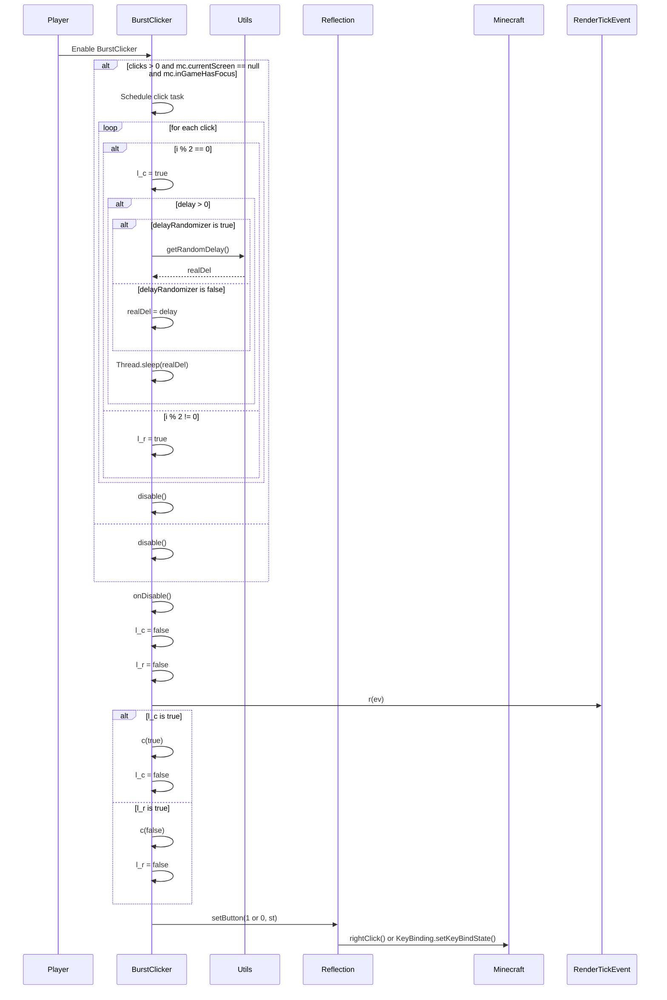

import { Callout, Steps, Cards, Card } from "nextra/components";

## BurstClicker Documentation

### Overview
The BurstClicker module automates rapid clicking in bursts. It offers various settings to customize its behavior, such as click speed, delay, randomization, and block placement.

### Settings

#### Artificial Drag Clicking
- **Description**: Enables artificial drag clicking.

#### Clicks
- **Description**: Sets the number of clicks per burst.
- **Range**: 0.0 to 50.0
- **Increment**: 1.0

<Callout type="default" emoji="️👾">
Adjust the number of clicks per burst to suit your needs.
</Callout>

#### Delay (ms)
- **Description**: Sets the delay between clicks in milliseconds.
- **Range**: 1.0 to 40.0
- **Increment**: 1.0

<Callout type="default" emoji="️👾">
Set an appropriate delay to avoid detection.
</Callout>

#### Delay Randomizer
- **Description**: Randomizes the delay between clicks to mimic human behavior.

<Callout type="info" emoji="️🚀">
Enable this to make the clicking pattern less predictable.
</Callout>

#### Place When Block
- **Description**: Places a block when a block is held.

<Callout type="info" emoji="️🚀">
Enable this to place blocks automatically when holding a block item.
</Callout>

### Usage
1. **Enable the Module**: Activate the BurstClicker module from the mod's interface.
2. **Adjust Settings**: Customize the settings to your preference. For example, set the number of clicks and enable the delay randomizer for a more human-like clicking pattern.
3. **Play**: The module will automate burst clicking based on your configured settings.

### Tips
<Callout type="default" emoji="️🚀">
Customize for Situations: Different scenarios (e.g., PvP combat vs. building) might benefit from different settings.
</Callout>

### Example Configuration
- **Artificial Drag Clicking**: Enabled
- **Clicks**: 20.0
- **Delay (ms)**: 10.0
- **Delay Randomizer**: Enabled
- **Place When Block**: Enabled

By customizing these settings, you can optimize the BurstClicker module to best fit your gameplay style and requirements.