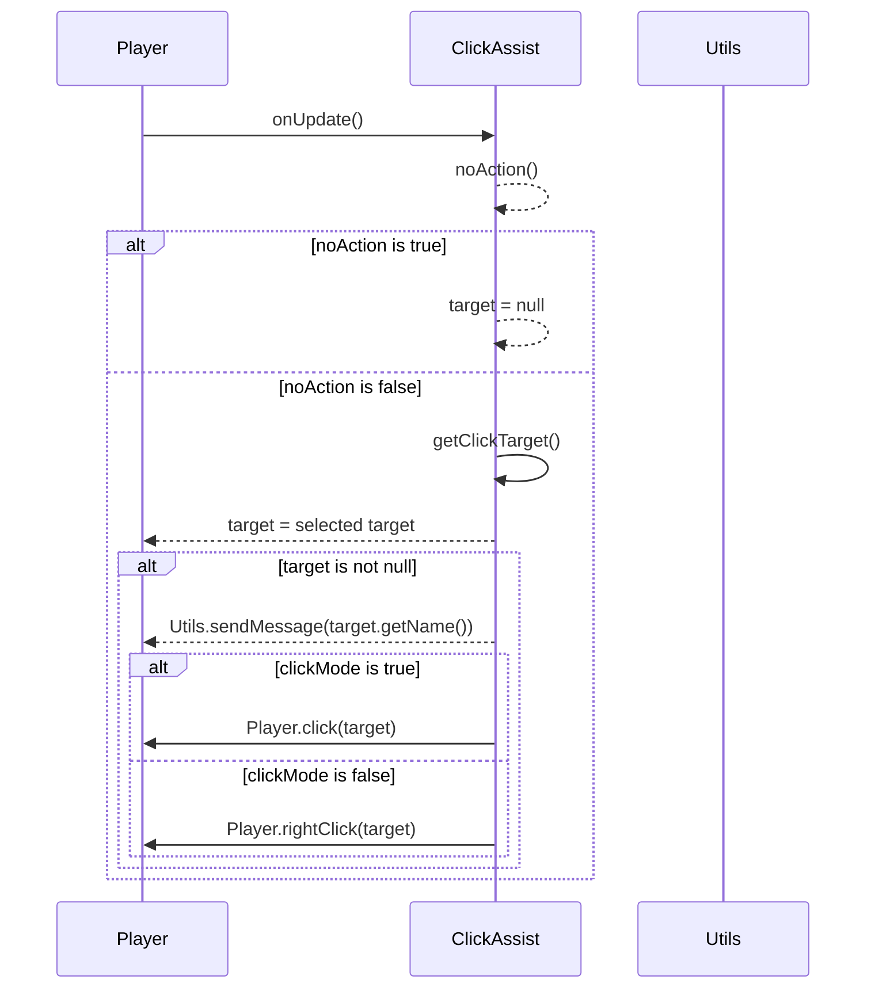

import { Callout, Steps, Cards, Card } from "nextra/components";

## ClickAssist Documentation

### Overview
The ClickAssist module enhances your clicking abilities by providing various automated click functionalities. It offers settings to customize its behavior to suit different playstyles and preferences.

### Settings

#### Click Mode
- **Description**: Determines the type of click action.
- **Options**: Left Click, Right Click

<Callout type="default" emoji="️👾">
Choose Left Click for standard attacks and Right Click for special actions or item usage.
</Callout>

#### Click Speed
- **Description**: Controls the speed of automated clicks.
- **Range**: 1.0 to 20.0
- **Increment**: 0.1

<Callout type="default" emoji="️👾">
Higher Click Speed can increase the frequency of actions but may be more detectable.
</Callout>

#### Target Selection
- **Description**: Defines the method for selecting targets.
- **Options**: Nearest, Random, Priority

<Callout type="info" emoji="️🚀">
Adjust Target Selection: Nearest for close combat, Random for unpredictability, and Priority for specific targets.
</Callout>

#### Distance
- **Description**: Specifies the maximum distance to a target for the click assist to activate.
- **Range**: 1.0 to 10.0
- **Increment**: 0.5

#### Click While Moving
- **Description**: Enables click assist while the player is moving.

<Callout type="info" emoji="️🚀">
Click While Moving can help maintain pressure on targets while staying mobile.
</Callout>

### Usage
1. **Enable the Module**: Activate the ClickAssist module from the mod's interface.
2. **Adjust Settings**: Customize the settings to your preference. For example, increase the Click Speed for faster actions or enable Click While Moving to maintain mobility.
3. **Play**: The click assist will automate clicks based on your configured settings.

### Tips
<Callout type="default" emoji="️🚀">
Customize for Situations: Different scenarios (e.g., PvP combat vs. casual play) might benefit from different settings.
</Callout>

### Example Configuration
- **Click Mode**: Left Click
- **Click Speed**: 10.0
- **Target Selection**: Nearest
- **Distance**: 5.0
- **Click While Moving**: Enabled

By customizing these settings, you can optimize the ClickAssist module to best fit your gameplay style and requirements.