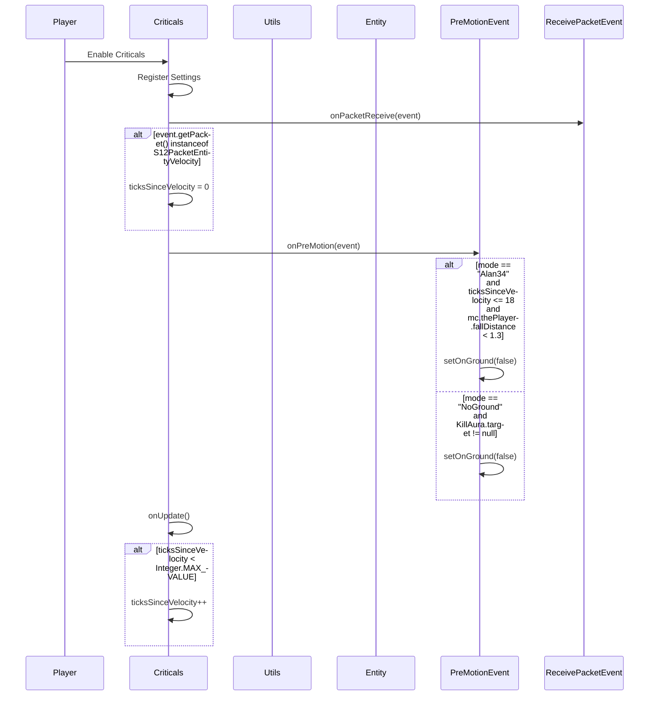

import { Callout, Steps, Cards, Card } from "nextra/components";

## Criticals Documentation

### Overview
The Criticals module ensures that you get a critical hit every time you attack. It offers various settings to customize its behavior, such as mode and conditions for critical hits.

### Settings

#### Mode
- **Description**: Sets the mode for the Criticals module.
- **Options**: Alan34, NoGround

<Callout type="default" emoji="️👾">
Choose the mode that best fits your combat style.
</Callout>

### Usage
1. **Enable the Module**: Activate the Criticals module from the mod's interface.
2. **Adjust Settings**: Customize the mode to your preference. For example, select "Alan34" or "NoGround" based on your combat strategy.
3. **Play**: The module will ensure you get critical hits based on your configured settings.

### Tips
<Callout type="default" emoji="️🚀">
Customize for Situations: Different scenarios (e.g., PvP combat vs. casual play) might benefit from different settings.
</Callout>

### Example Configuration
- **Mode**: Alan34

By customizing these settings, you can optimize the Criticals module to best fit your gameplay style and requirements.