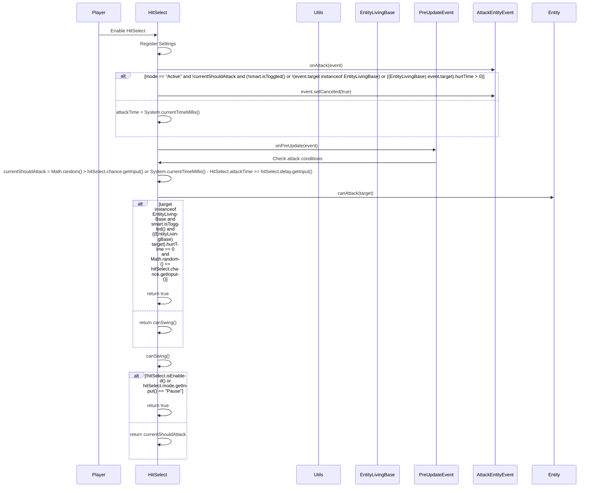

import { Callout, Steps, Cards, Card } from "nextra/components";

## HitSelect Documentation

### Overview
The HitSelect module chooses the best time to hit an enemy. It offers various settings to customize its behavior, such as mode, delay, chance, and smart toggle.
<Callout type="default" emoji="️🚀">
Hit Select is compatible with the Auto Clicker module, but also with legitimate clicking or even external clicker programs.
</Callout>

### Settings

#### Mode
- **Description**: Sets the mode for the HitSelect module.
- **Options**: Pause, Active

#### Delay
- **Description**: Sets the delay between attacks in milliseconds.
- **Range**: 300 to 500
- **Increment**: 1

<Callout type="default" emoji="️👾">
Adjust the delay to control the timing between attacks.
</Callout>

#### Chance
- **Description**: Sets the chance of an attack occurring.
- **Range**: 0 to 100
- **Increment**: 1

<Callout type="default" emoji="️👾">
Set a higher chance to increase the likelihood of attacks.
</Callout>

#### Smart
- **Description**: Enables smart targeting to choose the best time to hit.

<Callout type="info" emoji="️🚀">
Enable this to make your attacks more strategic.
</Callout>

### Usage
1. **Enable the Module**: Activate the HitSelect module from the mod's interface.
2. **Adjust Settings**: Customize the settings to your preference. For example, set the mode to Active and adjust the delay and chance for optimal performance.
3. **Play**: The module will choose the best time to hit based on your configured settings.

### Example Configuration
- **Mode**: Active
- **Delay**: 400
- **Chance**: 80
- **Smart**: Enabled

By customizing these settings, you can optimize the HitSelect module to best fit your gameplay style and requirements.