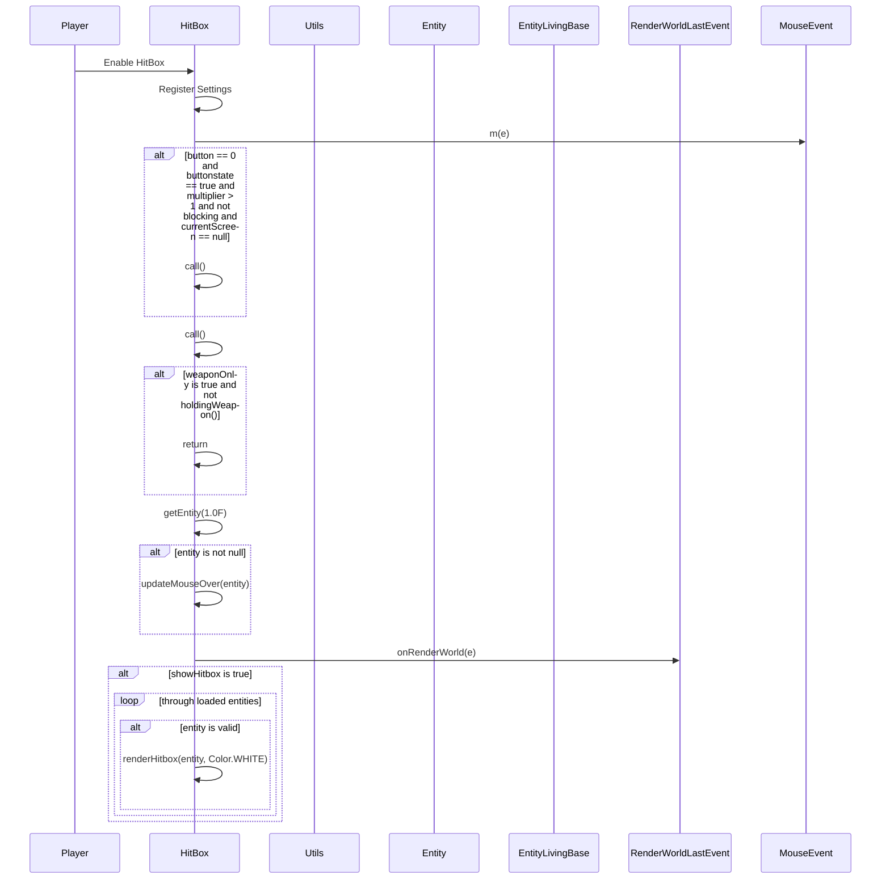

import { Callout, Steps, Cards, Card } from "nextra/components";

## HitBox Documentation

### Overview
The HitBox module modifies the hitbox size of entities to make them easier to hit. It offers various settings to customize its behavior, such as hitbox multiplier, visibility, and targeting options.

### Settings

#### Multiplier
- **Description**: Adjusts the size of the hitbox.
- **Range**: 1.0 to 5.0
- **Increment**: 0.05

<Callout type="default" emoji="️👾">
Increase the multiplier to make hitboxes larger and easier to hit.
</Callout>

#### Players Only
- **Description**: Affects only player entities.

<Callout type="default" emoji="️👾">
Enable this to target only players.
</Callout>

#### Show New Hitbox
- **Description**: Displays the modified hitbox visually.

<Callout type="info" emoji="️🚀">
Enable this to see the new hitbox size.
</Callout>

#### Weapon Only
- **Description**: Affects hitboxes only when holding a weapon.

<Callout type="info" emoji="️🚀">
Enable this to modify hitboxes only when you are armed.
</Callout>

### Usage
1. **Enable the Module**: Activate the HitBox module from the mod's interface.
2. **Adjust Settings**: Customize the settings to your preference. For example, increase the multiplier to enlarge hitboxes or enable Players Only to focus on player entities.
3. **Play**: The module will modify hitbox sizes based on your configured settings.

### Example Configuration
- **Multiplier**: 1.5
- **Players Only**: Enabled
- **Show New Hitbox**: Enabled
- **Weapon Only**: Enabled

By customizing these settings, you can optimize the HitBox module to best fit your gameplay style and requirements.