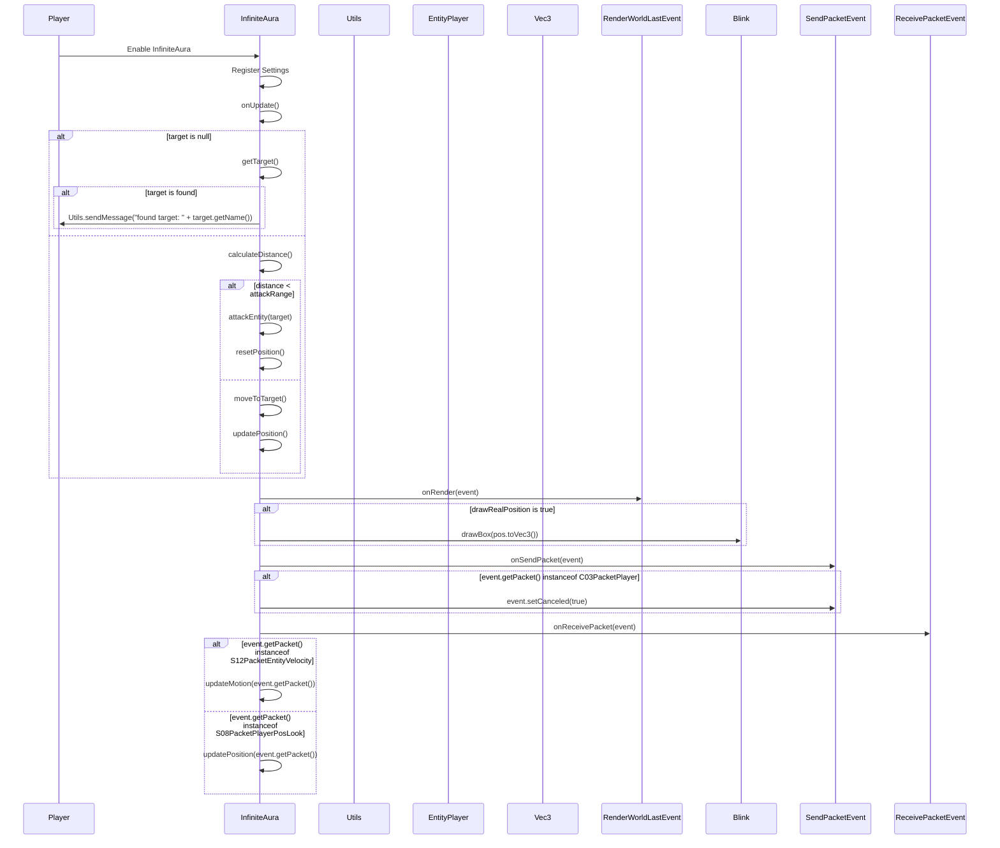

import { Callout, Steps, Cards, Card } from "nextra/components";

## InfiniteAura Documentation

### Overview
The InfiniteAura module allows you to hit targets from over 6 blocks away. It offers various settings to customize its behavior, such as mode, range, attack range, and speed multiplier.

### Settings

#### Mode
- **Description**: Sets the mode for the InfiniteAura module.
- **Options**: Silent

#### Range
- **Description**: Sets the range for detecting targets.
- **Range**: 6 to 30
- **Increment**: 1

<Callout type="default" emoji="️👾">
Adjust the range to control how far you can detect targets.
</Callout>

#### Attack Range
- **Description**: Sets the range for attacking targets.
- **Range**: 3 to 6
- **Increment**: 1

<Callout type="default" emoji="️👾">
Set an appropriate attack range to ensure you can hit targets effectively.
</Callout>

#### Move Speed Multiplier
- **Description**: Adjusts the movement speed multiplier.
- **Range**: 1 to 5
- **Increment**: 0.1

<Callout type="default" emoji="️👾">
Increase the multiplier to move faster towards targets.
</Callout>

#### Draw Real Position
- **Description**: Displays the real position visually.

<Callout type="info" emoji="️🚀">
Enable this to see your real position during movement.
</Callout>

#### Ignore Teammates
- **Description**: Ignores teammates when targeting.

<Callout type="default" emoji="️👾">
Enable this to avoid targeting your teammates.
</Callout>

#### Blink
- **Description**: Toggles the blink feature to queue packets.

<Callout type="info" emoji="️🚀">
Enable this to queue packets and avoid detection.
</Callout>

#### GrimAC BadPacketsE
- **Description**: Sets the GrimAC BadPacketsE value in ticks.
- **Range**: 1 to 20
- **Increment**: 1

### Usage
1. **Enable the Module**: Activate the InfiniteAura module from the mod's interface.
2. **Adjust Settings**: Customize the settings to your preference. For example, increase the range to detect targets from further away or enable Draw Real Position to visualize your real position.
3. **Play**: The module will allow you to hit targets from over 6 blocks away based on your configured settings.

### Tips
<Callout type="default" emoji="️🚀">
Customize for Situations: Different scenarios (e.g., PvP combat vs. casual play) might benefit from different settings.
</Callout>

### Example Configuration
- **Mode**: Silent
- **Range**: 20
- **Attack Range**: 5
- **Move Speed Multiplier**: 2.0
- **Draw Real Position**: Enabled
- **Ignore Teammates**: Enabled
- **Blink**: Enabled
- **GrimAC BadPacketsE**: 10

By customizing these settings, you can optimize the InfiniteAura module to best fit your gameplay style and requirements.