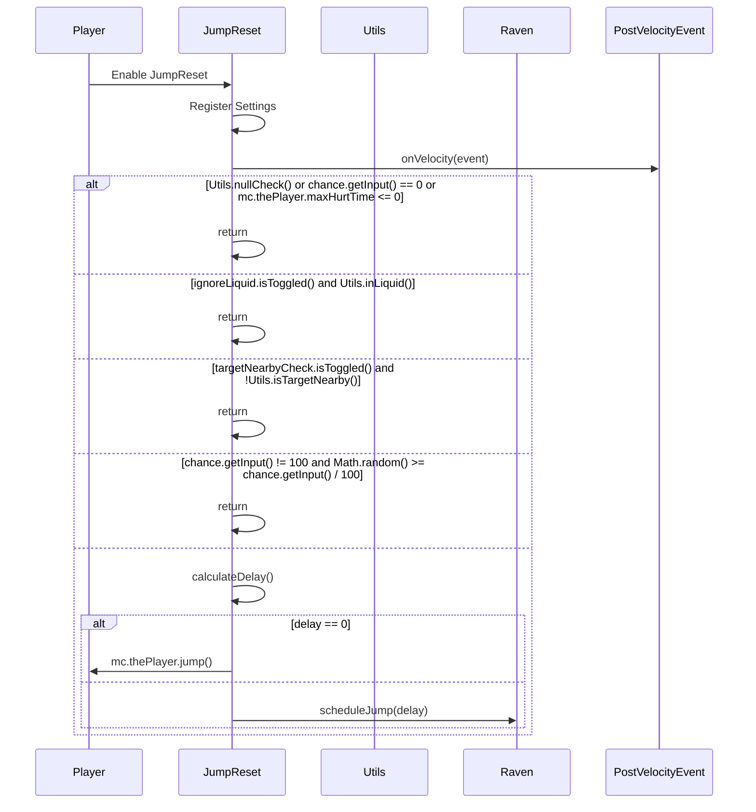

import { Callout, Steps, Cards, Card } from "nextra/components";

## JumpReset Documentation

### Overview
The JumpReset module ensures that you automatically jump to reset your attack timer after taking damage. It offers various settings to customize its behavior, such as delay, chance, and conditions for jumping.

### Settings

#### Min Delay (ms)
- **Description**: Sets the minimum delay between taking damage and jumping.
- **Range**: 0 to 150
- **Increment**: 1

<Callout type="default" emoji="️👾">
Set a minimum delay to control the timing of your jumps.
</Callout>

#### Max Delay (ms)
- **Description**: Sets the maximum delay between taking damage and jumping.
- **Range**: 0 to 150
- **Increment**: 1

<Callout type="default" emoji="️👾">
Set a maximum delay to add variability to your jumps.
</Callout>

#### Chance (%)
- **Description**: Sets the probability of jumping after taking damage.
- **Range**: 0 to 100
- **Increment**: 1

<Callout type="default" emoji="️👾">
Adjust the chance to make your jumps less predictable.
</Callout>

#### Target Nearby Check
- **Description**: Only jump if there are nearby targets.

<Callout type="info" emoji="️🚀">
Enable this to ensure you only jump when enemies are close.
</Callout>

#### Ignore Liquid
- **Description**: Prevents jumping when in liquid.

<Callout type="info" emoji="️🚀">
Enable this to avoid jumping while in water or lava.
</Callout>

### Usage
1. **Enable the Module**: Activate the JumpReset module from the mod's interface.
2. **Adjust Settings**: Customize the settings to your preference. For example, set the delay range and chance to control when and how often you jump.
3. **Play**: The module will automatically jump to reset your attack timer based on your configured settings.

### Tips
<Callout type="default" emoji="️🚀">
Customize for Situations: Different scenarios (e.g., PvP combat vs. casual play) might benefit from different settings.
</Callout>

### Example Configuration
- **Min Delay (ms)**: 20
- **Max Delay (ms)**: 100
- **Chance (%)**: 80
- **Target Nearby Check**: Enabled
- **Ignore Liquid**: Enabled

By customizing these settings, you can optimize the JumpReset module to best fit your gameplay style and requirements.