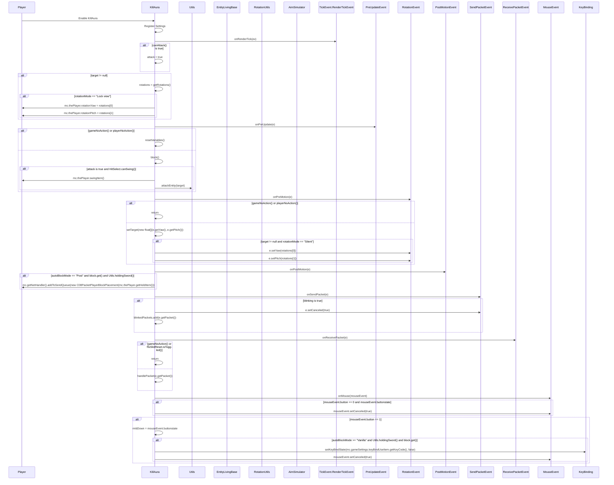

import { Callout, Steps, Cards, Card } from "nextra/components";

## KillAura Documentation

### Overview
The KillAura module automates attacking nearby entities. It offers various settings to customize its behavior, such as attack speed, range, target selection, and more.

### Settings

#### APS (Attacks Per Second)
- **Description**: Sets the number of attacks per second.
- **Range**: 1.0 to 20.0
- **Increment**: 0.5

<Callout type="default" emoji="️👾">
Adjust the APS to control the speed of attacks.
</Callout>

#### AutoBlock Mode
- **Description**: Sets the mode for auto-blocking.
- **Options**: Manual, Vanilla, Post, Swap, Interact A, Interact B, Fake, Partial, Watchdog 1.12.2

#### FOV
- **Description**: Sets the field of view within which the KillAura will operate.
- **Range**: 30.0 to 360.0
- **Increment**: 4.0

<Callout type="info" emoji="️🚀">
Adjust FOV: Setting a lower FOV can make the KillAura more focused and less noticeable.
</Callout>

#### Attack Range
- **Description**: Sets the range for attacking targets.
- **Range**: 3.0 to 6.0
- **Increment**: 0.1

<Callout type="default" emoji="️👾">
Set an appropriate attack range to ensure you can hit targets effectively.
</Callout>

#### Swing Range
- **Description**: Sets the range for swinging at targets.
- **Range**: 3.0 to 8.0
- **Increment**: 0.1

#### Block Range
- **Description**: Sets the range for blocking.
- **Range**: 3.0 to 12.0
- **Increment**: 0.1

#### Rotation Mode
- **Description**: Sets the mode for rotations.
- **Options**: None, Silent, Lock view

#### Rotation Target
- **Description**: Sets the target for rotations.
- **Options**: Head, Nearest, Constant

#### Rotation Simulator
- **Description**: Sets the simulator for rotations.
- **Options**: None, Lazy, Noise

#### Rotation Speed
- **Description**: Sets the speed for rotations.
- **Range**: 0 to 5
- **Increment**: 0.05

#### Sort Mode
- **Description**: Sets the mode for sorting targets.
- **Options**: Health, HurtTime, Distance, Yaw

#### Switch Delay
- **Description**: Sets the delay between switching targets in milliseconds.
- **Range**: 50.0 to 1000.0
- **Increment**: 25.0

#### Target Invisible
- **Description**: Toggles targeting of invisible entities.

#### Target Player
- **Description**: Toggles targeting of player entities.

#### Target Entity
- **Description**: Toggles targeting of non-player entities.

#### Disable in Inventory
- **Description**: Disables KillAura when in inventory.

#### Disable While Blocking
- **Description**: Disables KillAura while blocking.

#### Disable While Mining
- **Description**: Disables KillAura while mining.

#### Fix Slot Reset
- **Description**: Fixes the slot reset issue.

#### Fix NoSlow Flag
- **Description**: Fixes the NoSlow flag issue.

#### Hit Through Blocks
- **Description**: Allows hitting through blocks.

#### Ignore Teammates
- **Description**: Ignores teammates when targeting.

#### Manual Block
- **Description**: Enables manual block mode.

#### Require Mouse Down
- **Description**: Requires the mouse button to be held down to attack.

#### Silent Swing
- **Description**: Enables silent swinging while blocking.

#### Weapon Only
- **Description**: Activates KillAura only when holding a weapon.

### Usage
1. **Enable the Module**: Activate the KillAura module from the mod's interface.
2. **Adjust Settings**: Customize the settings to your preference. For example, set the APS to control the speed of attacks or enable Ignore Teammates to avoid targeting your allies.
3. **Play**: The module will automate attacking nearby entities based on your configured settings.

### Tips
<Callout type="default" emoji="️🚀">
Customize for Situations: Different scenarios (e.g., PvP combat vs. casual play) might benefit from different settings.
</Callout>

### Example Configuration
- **APS**: 16.0
- **AutoBlock Mode**: Vanilla
- **FOV**: 360.0
- **Attack Range**: 3.2
- **Swing Range**: 3.2
- **Block Range**: 6.0
- **Rotation Mode**: Silent
- **Rotation Target**: Head
- **Rotation Simulator**: None
- **Rotation Speed**: 5
- **Sort Mode**: Health
- **Switch Delay**: 200.0
- **Target Invisible**: Enabled
- **Target Player**: Enabled
- **Target Entity**: Disabled
- **Disable in Inventory**: Enabled
- **Disable While Blocking**: Disabled
- **Disable While Mining**: Disabled
- **Fix Slot Reset**: Disabled
- **Fix NoSlow Flag**: Enabled
- **Hit Through Blocks**: Enabled
- **Ignore Teammates**: Enabled
- **Manual Block**: Disabled
- **Require Mouse Down**: Disabled
- **Silent Swing**: Disabled
- **Weapon Only**: Disabled

By customizing these settings, you can optimize the KillAura module to best fit your gameplay style and requirements.