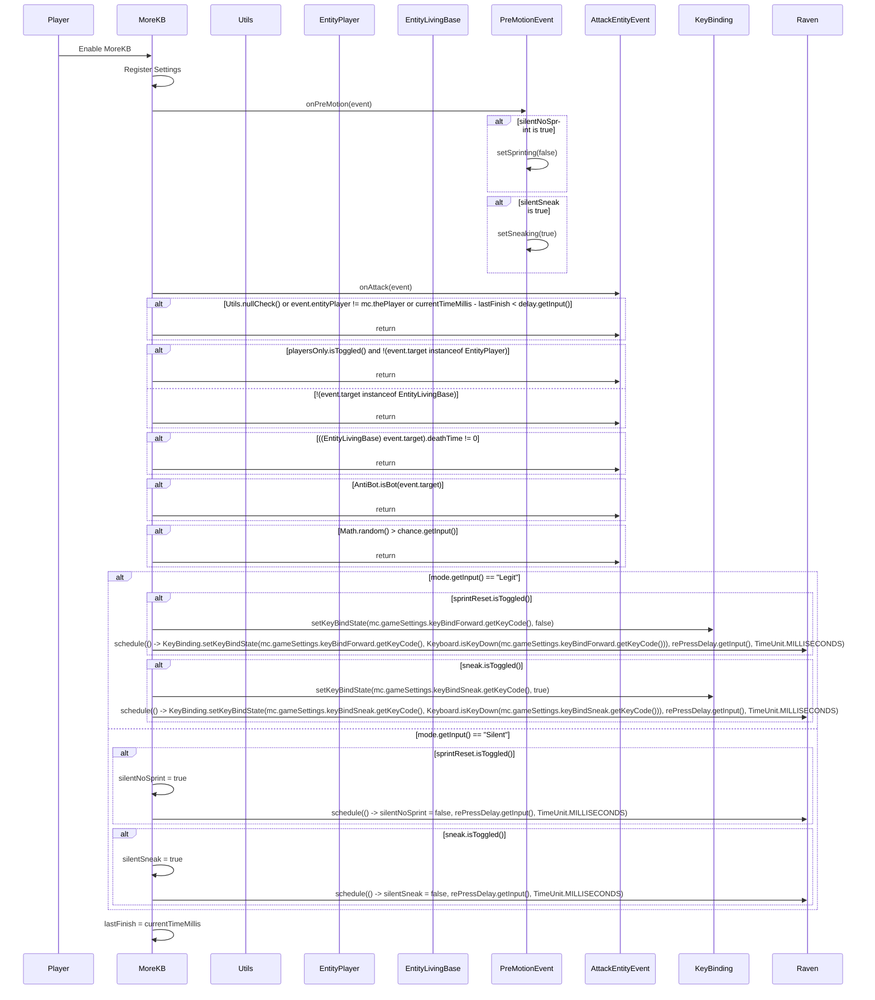

import { Callout, Steps, Cards, Card } from "nextra/components";

## MoreKB Documentation

### Overview
The MoreKB module increases the knockback dealt to opponents. It offers various settings to customize its behavior, such as mode, chance, delay, and additional conditions.

### Settings

#### Mode
- **Description**: Sets the mode for the MoreKB module.
- **Options**: Legit, Silent

#### Chance (%)
- **Description**: Sets the probability of applying knockback.
- **Range**: 0 to 100
- **Increment**: 1

<Callout type="default" emoji="️👾">
Adjust the chance to control how often knockback is applied.
</Callout>

#### Delay (ms)
- **Description**: Sets the delay between applying knockback.
- **Range**: 200 to 750
- **Increment**: 1

<Callout type="default" emoji="️👾">
Set an appropriate delay to avoid detection.
</Callout>

#### Re-press Delay (ms)
- **Description**: Sets the delay for re-pressing keys.
- **Range**: 1 to 500
- **Increment**: 1

#### Players Only
- **Description**: Affects only player entities.

<Callout type="default" emoji="️👾">
Enable this to target only players.
</Callout>

#### Sprint Reset
- **Description**: Resets sprinting when applying knockback.

<Callout type="info" emoji="️🚀">
Enable this to ensure sprinting is reset.
</Callout>

#### Sneak
- **Description**: Enables sneaking when applying knockback.

<Callout type="info" emoji="️🚀">
Enable this to sneak when knockback is applied.
</Callout>

### Usage
1. **Enable the Module**: Activate the MoreKB module from the mod's interface.
2. **Adjust Settings**: Customize the settings to your preference. For example, set the mode to Silent and adjust the chance and delay for optimal performance.
3. **Play**: The module will increase the knockback dealt to opponents based on your configured settings.

### Tips
<Callout type="default" emoji="️🚀">
Customize for Situations: Different scenarios (e.g., PvP combat vs. casual play) might benefit from different settings.
</Callout>

### Example Configuration
- **Mode**: Legit
- **Chance**: 80
- **Delay**: 300
- **Re-press Delay**: 100
- **Players Only**: Enabled
- **Sprint Reset**: Enabled
- **Sneak**: Enabled

By customizing these settings, you can optimize the MoreKB module to best fit your gameplay style and requirements.