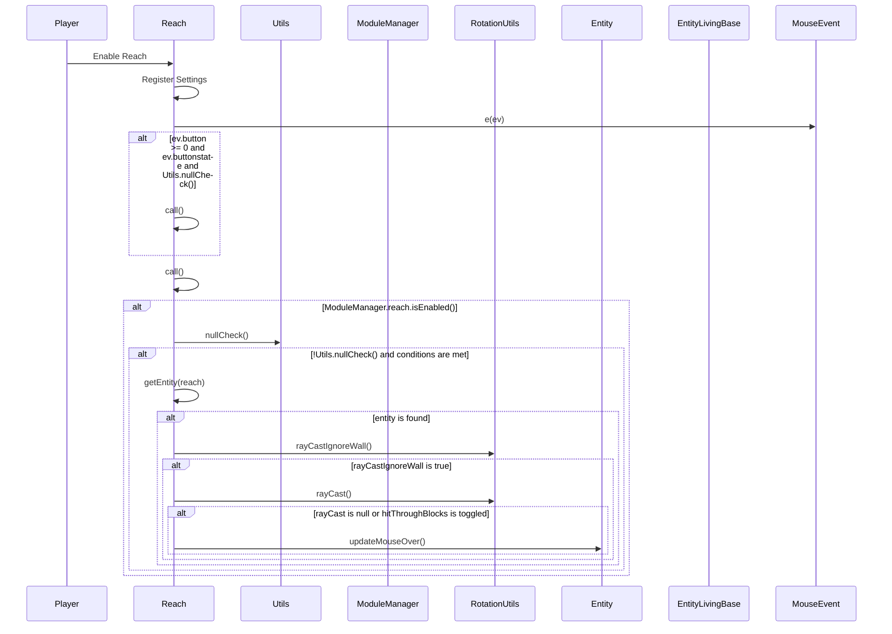

import { Callout, Steps, Cards, Card } from "nextra/components";
import Link from "next/link";

## Reach Documentation

### Overview
The Reach module extends the reach distance for hitting entities. It offers various settings to customize its behavior, such as minimum and maximum reach, and conditions for activating the extended reach.
<Callout type="default" emoji="️⚠">
It is not uncommon for advanced anti-cheats to detect reach cheats on all settings. If you know that the server you play uses such an anti-cheat, you may be interested in using the <Link href="/Modules/Player/Backtrack"><strong>Backtrack</strong></Link> module instead.
</Callout>

### Settings

#### Min Reach
- **Description**: Sets the minimum reach distance.
- **Range**: 3.0 to 6.0
- **Increment**: 0.05

<Callout type="default" emoji="️👾">
Adjust the minimum reach distance to control how close you need to be to hit entities.
</Callout>

#### Max Reach
- **Description**: Sets the maximum reach distance.
- **Range**: 3.0 to 6.0
- **Increment**: 0.05

<Callout type="default" emoji="️👾">
Adjust the maximum reach distance to control how far you can hit entities.
</Callout>

#### Weapon Only
- **Description**: Extends reach only when holding a weapon.

<Callout type="info" emoji="️🚀">
Enable this to extend reach only when you are armed.
</Callout>

#### Moving Only
- **Description**: Extends reach only when moving.

<Callout type="info" emoji="️🚀">
Enable this to extend reach only when you are in motion.
</Callout>

#### Sprint Only
- **Description**: Extends reach only when sprinting.

<Callout type="info" emoji="️🚀">
Enable this to extend reach only when you are sprinting.
</Callout>

#### Hit Through Blocks
- **Description**: Allows hitting through blocks.

<Callout type="info" emoji="️🚀">
Enable this to hit entities through blocks.
</Callout>

### Usage
1. **Enable the Module**: Activate the Reach module from the mod's interface.
2. **Adjust Settings**: Customize the settings to your preference. For example, set the min and max reach distances or enable Hit Through Blocks to hit entities through obstacles.
3. **Play**: The module will extend your reach distance based on your configured settings.

### Tips
<Callout type="default" emoji="️🚀">
Customize for Situations: Different scenarios (e.g., PvP combat vs. casual play) might benefit from different settings.
</Callout>

### Example Configuration
- **Min Reach**: 3.1
- **Max Reach**: 3.5
- **Weapon Only**: Enabled
- **Moving Only**: Enabled
- **Sprint Only**: Disabled
- **Hit Through Blocks**: Disabled

By customizing these settings, you can optimize the Reach module to best fit your gameplay style and requirements.