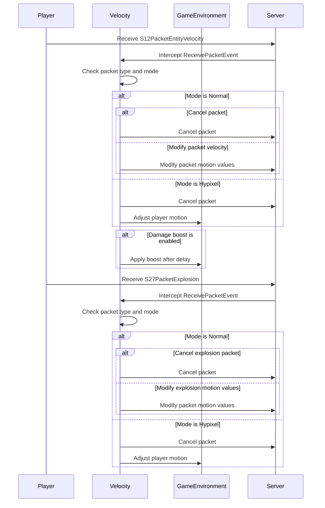

import { Callout, Steps, Cards, Card } from "nextra/components";

## Velocity Documentation

### Overview
The Velocity module allows you to change the amount of knockback you take.

<Callout type="default" emoji="️👾">
Change your Mode setting according to the server you're going to play on.
</Callout>

### Settings

#### Horizontal
- **Description**: Changes the amount of knockback you take horizontally.
- **Range**: -100 to 100
- **Increment**: 1

#### Vertical
- **Description**: Changes the amount of knockback you take vertically.
- **Range**: 0 to 100
- **Increment**: 1

<Callout type="default" emoji="️👾">
Horizontal 0 and Vertical 100 generally work best.
</Callout>

#### Cancel Explosion Packet
- **Description**: Attempts to reduce the knockback you receive from explosions.

#### Cancel Air
- **Description**: Does not apply velocity while you are in the air.

#### Damage Boost
- **Description**: Boosts your motion on damage.

#### Lobby Check
- **Description**: Prevents your Velocity settings from affecting you while you're in a lobby.

### Usage
1. **Enable the Module**: Activate the Velocity module from the mod's interface.
2. **Adjust Settings**: Customize the settings to your preference. For example, set your Horizontal slider value according to how much knockback you want your player to take.
3. **Play**: The Velocity will help you take less/more knockback on combat.

### Tips
<Callout type="default" emoji="️🚀">
Customize for Situations: On different use-cases (closet cheating, blatant cheating), you might want to adjust the amount of knockback you take.
</Callout>

### Example Configuration
- **Mode**: Hypixel
- **Horizontal**: 0
- **Vertical**: 100
- **Cancel explosion packet**: Enabled
- **Cancel air**: Enabled
- **Damage Boost**: Disabled
- **Lobby Check**: Enabled

