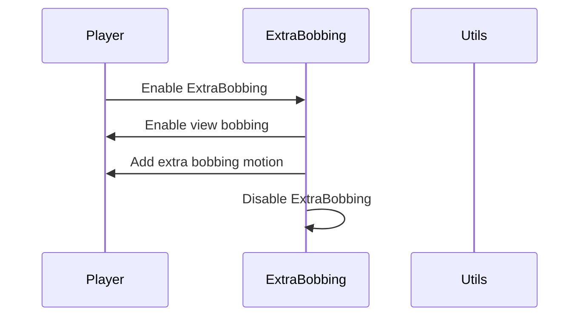

import { Callout, Steps, Cards, Card } from "nextra/components";

## ExtraBobbing Documentation

### Overview
The ExtraBobbing module adds extra bobbing motion to the player character's view while moving.

### Settings

#### Bobbing Level
- **Description**: Adjusts the level of extra bobbing motion.

<Callout type="default" emoji="️👾">
Adjust this to set the desired bobbing level.
</Callout>

### Usage
1. **Enable the Module**: Activate the ExtraBobbing module from the mod's interface.
2. **Adjust Settings**: Customize the bobbing level to your preference.
3. **Play**: The module will add extra bobbing motion to your view based on your configured settings.

### Example Configuration
- **Bobbing Level**: 1.0

By customizing these settings, you can optimize the ExtraBobbing module to best fit your gameplay style and requirements.