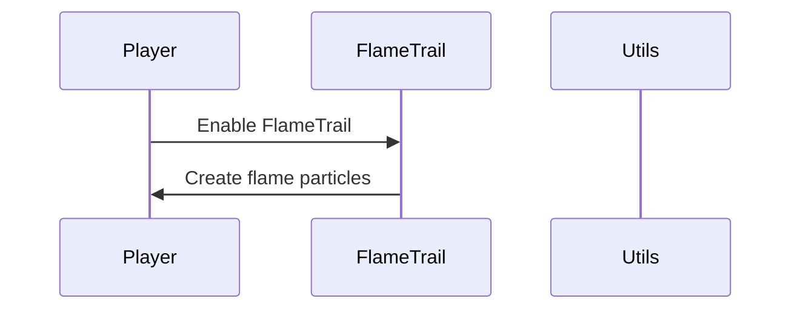

import { Callout, Steps, Cards, Card } from "nextra/components";

## FlameTrail Documentation

### Overview
The FlameTrail module creates a trail of flames behind the player character as they move.

### Settings

#### Flame Intensity
- **Description**: Adjusts the intensity of the flame trail.

<Callout type="default" emoji="️👾">
Adjust this to set the desired flame intensity.
</Callout>

### Usage
1. **Enable the Module**: Activate the FlameTrail module from the mod's interface.
2. **Adjust Settings**: Customize the flame intensity to your preference.
3. **Play**: The module will create a trail of flames behind your character based on your configured settings.

### Example Configuration
- **Flame Intensity**: 1.0

By customizing these settings, you can optimize the FlameTrail module to best fit your gameplay style and requirements.