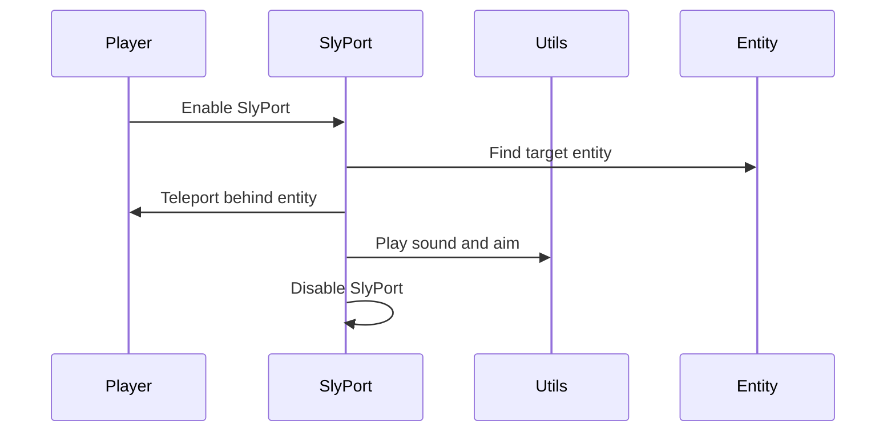

import { Callout, Steps, Cards, Card } from "nextra/components";

## SlyPort Documentation

### Overview
The SlyPort module teleports the player behind enemies. It allows customization of teleport range and additional options like aiming and playing sounds.

### Settings

#### Range
- **Description**: Sets the teleport range for the SlyPort module.

<Callout type="default" emoji="️👾">
Adjust this to set the desired teleport range.
</Callout>

#### Aim
- **Description**: Toggles whether the player should aim at the target after teleporting.

#### Play Sound
- **Description**: Toggles whether a sound should be played upon teleporting.

#### Players Only
- **Description**: Toggles whether only players should be targeted for teleportation.

### Usage
1. **Enable the Module**: Activate the SlyPort module from the mod's interface.
2. **Adjust Settings**: Customize the teleport range and other options to your preference.
3. **Play**: The module will teleport you behind enemies based on your configured settings.

### Example Configuration
- **Range**: 6
- **Aim**: Enabled
- **Play Sound**: Enabled
- **Players Only**: Enabled

By customizing these settings, you can optimize the SlyPort module to best fit your gameplay style and requirements.