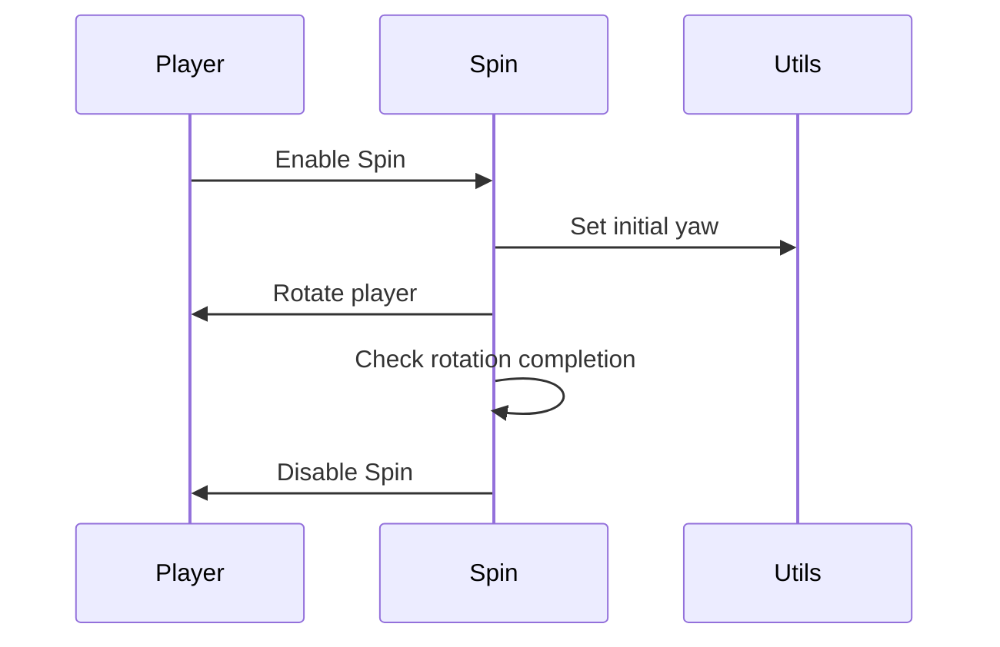

import { Callout, Steps, Cards, Card } from "nextra/components";

## Spin Documentation

### Overview
The Spin module rotates the player character in the game. It allows customization of rotation speed and angle.

### Settings

#### Rotation
- **Description**: Sets the rotation angle for the Spin module.

<Callout type="default" emoji="️👾">
Adjust this to set the desired rotation angle.
</Callout>

#### Speed
- **Description**: Sets the rotation speed for the Spin module.

<Callout type="default" emoji="️👾">
Adjust this to set the desired rotation speed.
</Callout>

### Usage
1. **Enable the Module**: Activate the Spin module from the mod's interface.
2. **Adjust Settings**: Customize the rotation angle and speed to your preference.
3. **Play**: The module will rotate the player character based on your configured settings.

### Example Configuration
- **Rotation**: 360
- **Speed**: 25

By customizing these settings, you can optimize the Spin module to best fit your gameplay style and requirements.