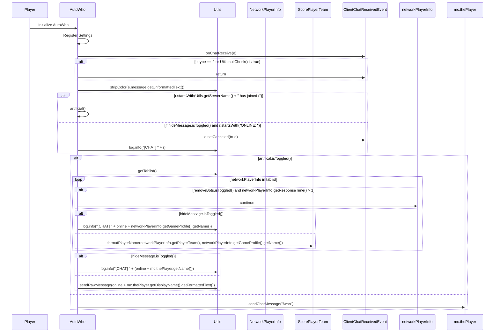

import { Callout, Steps, Cards, Card } from "nextra/components";

## AutoWho Documentation

### Overview
The AutoWho module automatically executes the `/who` command in the game, providing information about online players. It offers various settings to customize its behavior, including options to hide messages, remove bots, and use artificial methods to gather player information.

<Callout type="error" emoji="🚫">
This module is only available for Hypixel.
</Callout>

### Settings

#### Artificial
- **Description**: Uses artificial methods to gather player information.

<Callout type="default" emoji="️👾">
Enable this to use artificial methods for gathering player information.
</Callout>

#### Hide Message
- **Description**: Hides the `/who` command output message.

<Callout type="default" emoji="️👾">
Useful for keeping the chat clean by hiding the `/who` command output.
</Callout>

#### Remove Bots
- **Description**: Removes bots from the player list.

<Callout type="default" emoji="️👾">
Enable this to exclude bots from the player list.
</Callout>

### Usage
1. **Enable the Module**: Activate the AutoWho module from the mod's interface.
2. **Adjust Settings**: Customize the settings to your preference. For example, enable Artificial to use advanced methods for gathering player information, or enable Hide Message to keep the chat clean.
3. **Play**: The module will automatically execute the `/who` command and provide information about online players based on your configured settings.

### Tips
<Callout type="default" emoji="️🚀">
Customize for Situations: Different scenarios (e.g., team play vs. solo play) might benefit from different settings.
</Callout>

### Example Configuration
- **Artificial**: Enabled
- **Hide Message**: Enabled
- **Remove Bots**: Enabled

By customizing these settings, you can optimize the AutoWho module to best fit your gameplay style and requirements.