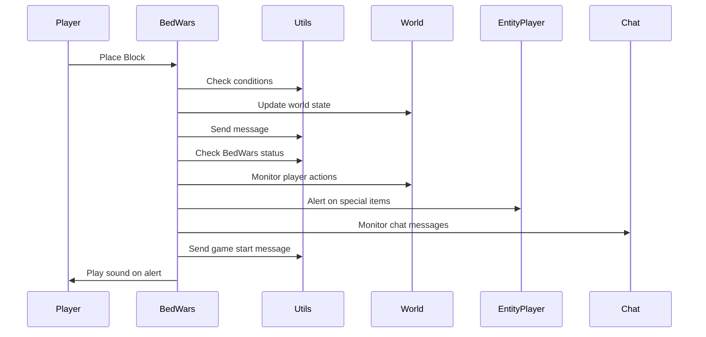

import { Callout, Steps, Cards, Card } from "nextra/components";

## BedWars Documentation

### Overview
The BedWars module assists players in monitoring and interacting with various elements in the BedWars game mode, such as placing blocks, detecting special items, and handling game events. It offers various settings to customize its behavior to suit different playstyles and preferences.
<Callout type="error" emoji="🚫">
This module is only available for Hypixel and Pika Network.
</Callout>

### Settings

#### Diamond Armor Alert
- **Description**: Alerts when a player equips diamond armor.

Enable this to get notified when players upgrade to diamond armor.

#### Ender Pearl Alert
- **Description**: Alerts when a player uses an ender pearl.

Useful for tracking potential threats from players teleporting.

#### Obsidian Alert
- **Description**: Alerts when a player places obsidian blocks.

#### Whitelist Own Bed
- **Description**: Whitelists your own bed to prevent alerts for it.

#### Ping on Alert
- **Description**: Plays a sound when an alert is triggered.

Enable this to have an audio cue for important alerts.

### Usage

1. **Enable the Module**: Activate the BedWars module from the mod's interface.
2. **Adjust Settings**: Customize the settings to your preference. For example, enable Diamond Armor Alert to get notified when players upgrade their armor, or enable Ping on Alert for audio cues.
3. **Play**: The module will assist you by providing alerts and monitoring game events based on your configured settings.

### Tips
<Callout type="default" emoji="️🚀">
**Customize for Situations**: Different scenarios (e.g., team play vs. solo play) might benefit from different settings.
</Callout>

### Example Configuration

- Diamond Armor Alert: Enabled
- Ender Pearl Alert: Enabled
- Obsidian Alert: Enabled
- Whitelist Own Bed: Enabled
- Ping on Alert: Enabled

By customizing these settings, you can optimize the BedWars module to best fit your gameplay style and requirements.