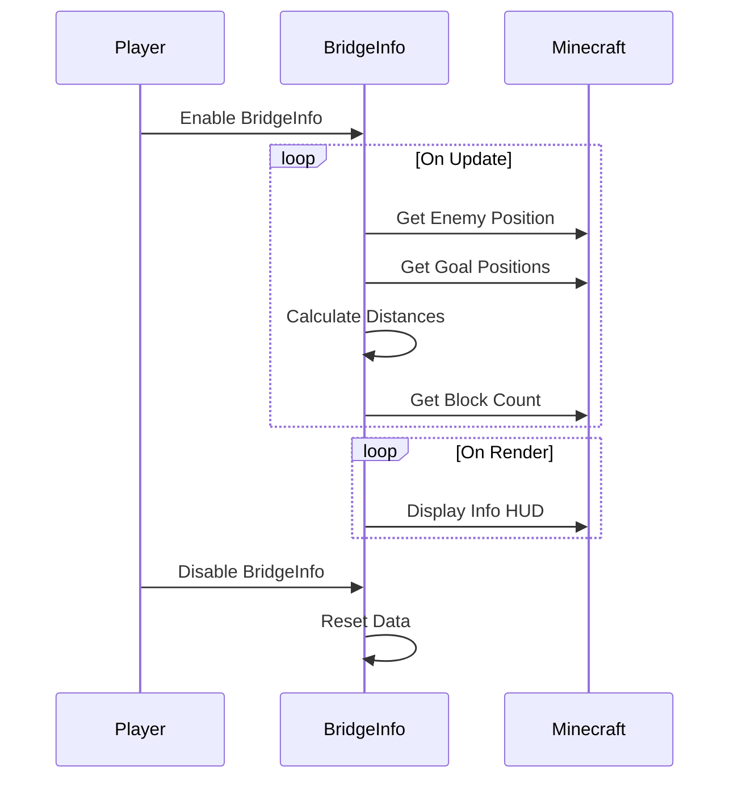

import { Callout, Steps, Cards, Card } from "nextra/components";

## BridgeInfo Documentation

### Overview
The BridgeInfo module provides essential information for the Bridge minigame on Hypixel, such as enemy distance to goals and the number of blocks in your inventory. It includes settings for editing the HUD position.

### Settings

#### Edit Position
- **Description**: Enables the editing of the HUD position.

<Callout type="default" emoji="️👾">
Enable this to customize the position of the HUD elements on your screen.
</Callout>

### Usage
1. **Enable the Module**: Activate the BridgeInfo module from the mod's interface.
2. **Adjust Settings**: Enable the Edit Position setting to customize the HUD position.
3. **Play**: The module will display relevant information for the Bridge minigame, such as enemy distance to goals and the number of blocks in your inventory.

### Example Configuration
- **Edit Position**: Enabled

By customizing these settings, you can optimize the BridgeInfo module to best fit your gameplay style and requirements.