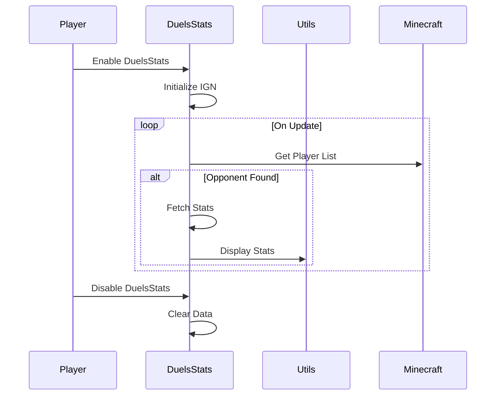

import { Callout, Steps, Cards, Card } from "nextra/components";

## DuelsStats Documentation

### Overview
The DuelsStats module provides detailed statistics for your duels on Hypixel. It can display wins, losses, win-loss ratio (WLR), and threat level of opponents. You can also configure it to send your in-game name (IGN) on join and display threat levels.
<Callout type="error" emoji="🚫">
This module is only available for Hypixel.
</Callout>

### Settings

#### Mode
- **Description**: Selects the mode for which to display statistics (e.g., overall, specific duel mode).

<Callout type="default" emoji="️👾">
Choose the mode to get relevant statistics for your duels.
</Callout>

#### Send IGN on Join
- **Description**: Toggles whether to send your in-game name when you join a duel.

<Callout type="default" emoji="️👾">
Enable this to automatically send your IGN when joining a duel.
</Callout>

#### Threat Level
- **Description**: Toggles the display of threat levels for opponents.

<Callout type="default" emoji="️👾">
Enable this to see the threat level of your opponents.
</Callout>

### Usage
1. **Enable the Module**: Activate the DuelsStats module from the mod's interface.
2. **Adjust Settings**: Customize the mode, send IGN on join, and threat level settings to your preference.
3. **Play**: The module will display relevant statistics and threat levels for your duels based on your configured settings.

### Example Configuration
- **Mode**: Overall
- **Send IGN on Join**: Enabled
- **Threat Level**: Enabled

By customizing these settings, you can optimize the DuelsStats module to best fit your gameplay style and requirements.