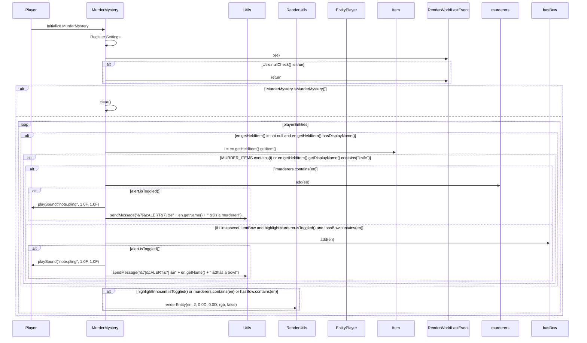

import { Callout, Steps, Cards, Card } from "nextra/components";

## MurderMystery Documentation

### Overview
The MurderMystery module assists players in identifying and highlighting murderers, players with bows, and innocents in the Murder Mystery game mode. It offers various settings to customize its behavior to suit different playstyles and preferences.
<Callout type="error" emoji="🚫">
This module is only available for Hypixel.
</Callout>

### Settings

#### Alert
- **Description**: Alerts when a player is identified as a murderer or has a bow.

<Callout type="default" emoji="️👾">
Enable this to get notified when players are identified as murderers or have a bow.
</Callout>

#### Highlight Murderer
- **Description**: Highlights players identified as murderers.

<Callout type="default" emoji="️👾">
Useful for easily spotting murderers in the game.
</Callout>

#### Highlight Bow
- **Description**: Highlights players with a bow.

<Callout type="default" emoji="️👾">
Enable this to highlight players who have a bow.
</Callout>

#### Highlight Innocent
- **Description**: Highlights innocent players.

<Callout type="default" emoji="️👾">
Enable this to highlight players who are innocent.
</Callout>

### Usage
1. **Enable the Module**: Activate the MurderMystery module from the mod's interface.
2. **Adjust Settings**: Customize the settings to your preference. For example, enable Alert to get notified when players are identified as murderers or have a bow, or enable Highlight Innocent to highlight innocent players.
3. **Play**: The module will assist you by identifying and highlighting players based on your configured settings.

### Tips
<Callout type="default" emoji="️🚀">
Customize for Situations: Different scenarios (e.g., team play vs. solo play) might benefit from different settings.
</Callout>

### Example Configuration
- **Alert**: Enabled
- **Highlight Murderer**: Enabled
- **Highlight Bow**: Enabled
- **Highlight Innocent**: Enabled

By customizing these settings, you can optimize the MurderMystery module to best fit your gameplay style and requirements.