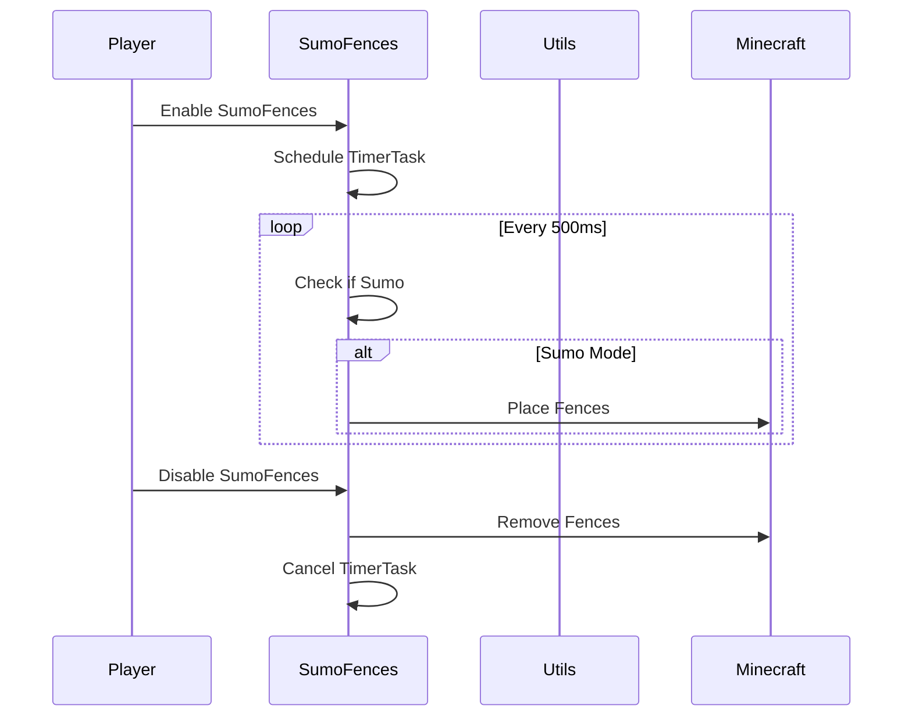

import { Callout, Steps, Cards, Card } from "nextra/components";

## SumoFences Documentation

### Overview
The SumoFences module is designed for the Hypixel Sumo game mode. It places fences around the arena to enhance the gameplay experience. You can customize the fence height and block type.
<Callout type="error" emoji="🚫">
This module is only available for Hypixel.
</Callout>

### Settings

#### Fence Height
- **Description**: Adjusts the height of the fences placed around the arena.

<Callout type="default" emoji="️👾">
Set the desired fence height to match your gameplay preferences.
</Callout>

#### Block Type
- **Description**: Selects the type of block to use for the fences (e.g., oak fence, leaves, glass, barrier).

<Callout type="default" emoji="️👾">
Choose the block type that best fits your visual preference.
</Callout>

### Usage
1. **Enable the Module**: Activate the SumoFences module from the mod's interface.
2. **Adjust Settings**: Customize the fence height and block type to your preference.
3. **Play**: The module will automatically place fences around the arena based on your configured settings.

### Example Configuration
- **Fence Height**: 4.0
- **Block Type**: Oak fence

By customizing these settings, you can optimize the SumoFences module to best fit your gameplay style and requirements.