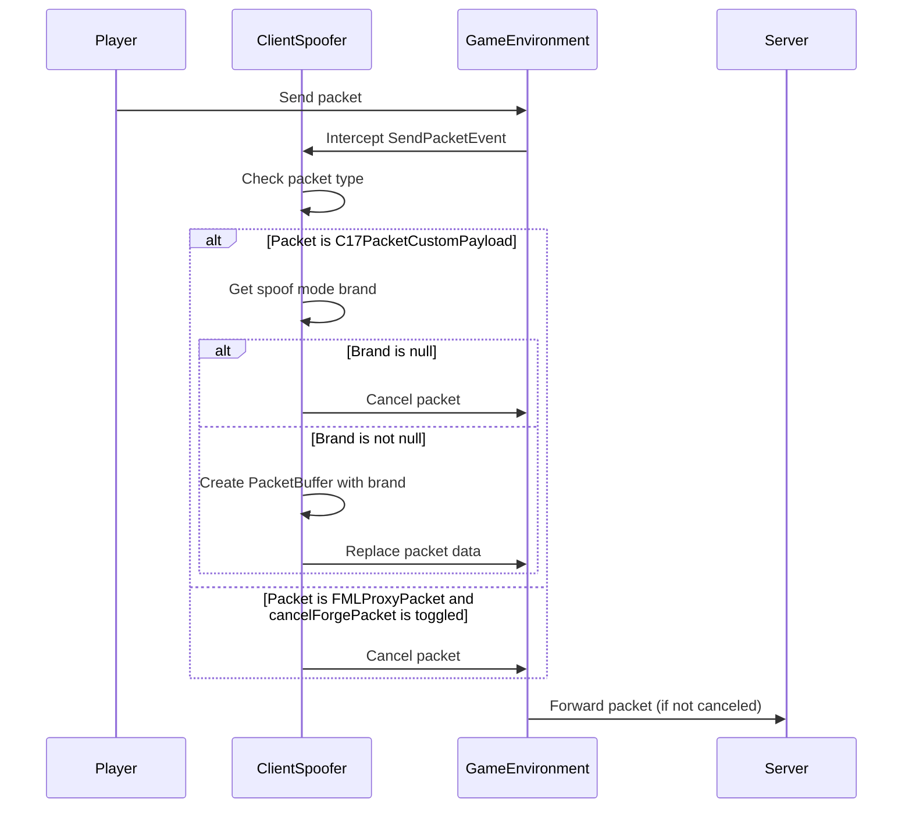

import { Callout, Steps, Cards, Card } from "nextra/components";

## ClientSpoofer Documentation

### Overview
Spoofs your client to a different one, so the server doesn't actually know which client you're using.

<Callout type="info" emoji="️ℹ">
This module is not recommended for use on most servers, as it can be considered cheating.
</Callout>

### Options

- **Vanilla**: Spoofs your client type to Vanilla (no mods).
- **Lunar**: Spoofs your client type to Lunar Client.
- **Cheatbreaker**: Spoofs your client type to Cheatbreaker.

