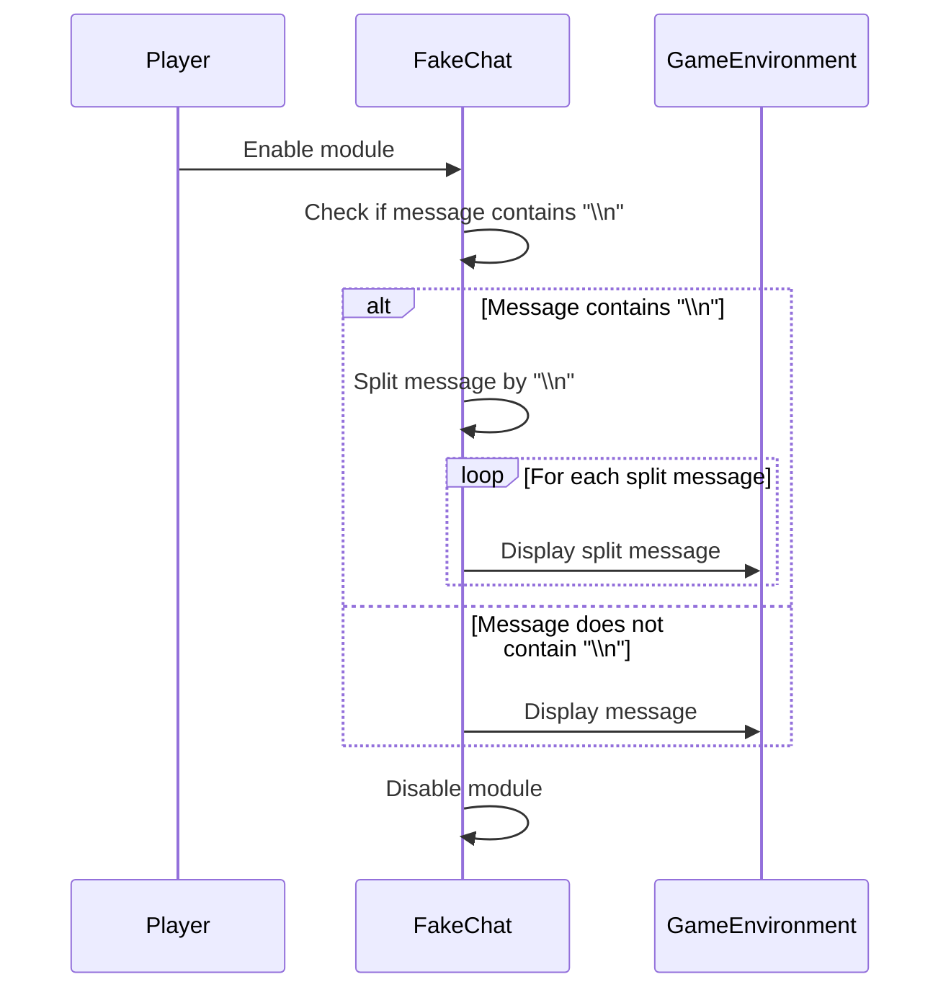

import { Callout, Steps, Cards, Card } from "nextra/components";

## FakeChat Documentation

### Overview
Sends a fake chat message.

### Usage
1. **Set your message**: Using the command line or command chat, set your message by using "fakechat [message]".
2. **Enabling the module**: Each time you enable the module, the specified message is shown.

