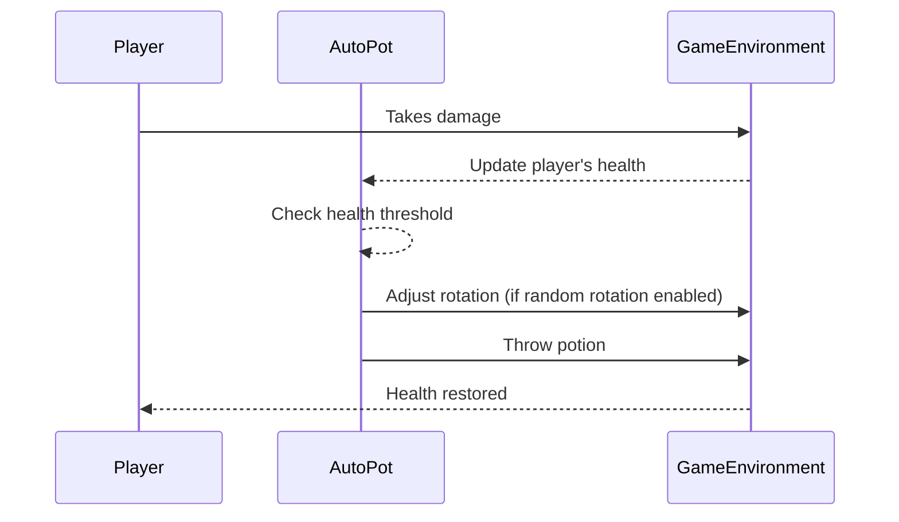

import { Callout, Steps, Cards, Card } from "nextra/components";

## Auto Pot Documentation

### Overview
The Auto Pot module automatically selects and throws healing potions.

<Callout type="default" emoji="️🚀">
Bind this module to a key to automatically consume potions when your health is low.
</Callout>

### Options

- **Automatically Throws Potions**: Enables the module to automatically use potions for healing or providing buffs.

- **Health Threshold**: Set the health level (between 1 and 20) at which potions are automatically thrown. The default setting is 10, meaning if your health drops to this level or below, a potion will be used to heal you.

- **Randomized Rotations**: When enabled, this feature randomizes your character's rotation when throwing a potion, making it harder for observers to detect the use of automation.

